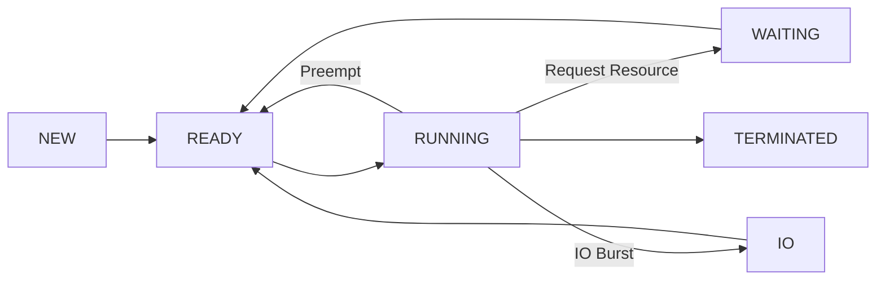

<div align="center">


[](https://git.io/typing-svg)


</div>

---

## 📋 Abstract

A **high-fidelity Operating System simulator** that models:

* CPU scheduling (Preemptive Priority + Round Robin)
* Resource allocation & contention
* Deadlock detection and recovery
* Starvation prevention via aging

Built as an **interactive CLI system**, allowing users to step through execution *tick by tick* and observe real OS behavior in real time.

---

## 🎀 Interactive CLI Experience

```
[Time = 42]

💖 Running:   P2
🎀 Ready:     P0, P3
🌸 Waiting:   P1 (R2)
🌷 IO Queue:  P4 (3 ticks)

Command → [Enter = step | a = auto-run]
```

### Features

* ⏱️ Step-by-step execution (`Enter`)
* ⚡ Auto-run mode (`a`)
* 📊 Live queue visualization
* 🎨 Pink-themed ANSI interface

---

## ⚙️ Process Lifecycle



---

## 🔮 Scheduling Engine

### 🧠 Hybrid Scheduling Strategy

```
Priority Scheduling (Preemptive)
        +
Round Robin (Same Priority)
        +
Aging Mechanism
```

### Behavior

* 🎯 **Higher priority always wins**
* 🔁 **Same priority → Round Robin (Quantum = 5)**
* ✨ **Aging every 10 ticks → prevents starvation**

---

## 🚨 Deadlock Engine

### Detection

* Resource Allocation Graph (Banker-style reduction)
* Runs **every clock tick**

### Recovery Strategy

```
1. Detect circular wait
2. Select victim (lowest priority)
3. Terminate process
4. Release all resources
5. Resume system safely
```

---

## 📐 Instruction Model

| Type    | Example  | Description                   |
| ------- | -------- | ----------------------------- |
| CPU     | `5`      | Execute for 5 time units      |
| Request | `R[1,2]` | Request 2 units of Resource 1 |
| Free    | `F[1,2]` | Release resources             |
| IO      | `IO{3}`  | Perform IO for 3 ticks        |

---

## 🧪 Simulation Scenarios

### 🔴 Deadlock Recovery

```
P0 holds R1 → needs R2
P1 holds R2 → needs R1

💥 Deadlock detected!
💀 Killing victim: P1
🔓 Resources released
```

---

### 🟢 Starvation Prevention (Aging)

```
Initial Priority: P0 = 20 (very low)

✨ Aging Triggered
→ P0 priority: 20 → 19 → 18 ...

✅ Eventually scheduled
```

---

## 🖥️ Example Output

```
[T=15]

Running → P1
Ready   → P0, P2
Waiting → P3 (R1 unavailable)

✨ Aging: P0 priority improved → 4

----------------------------------
[T=16]

🚨 Deadlock Detected!
💀 Terminating P3
🔓 Resources Released
```

---

## 📁 Project Structure

```
OS-Scheduler-Pink/
├── prj.py              # Core simulation engine
├── scenario1.txt       # Deadlock case
├── scenario2.txt       # Aging case
├── scenario3.txt       # Complex deadlock chain
└── README.md
```

---

## ▶️ How to Run

```bash
python prj.py scenario1.txt
```

### Controls

| Key    | Action         |
| ------ | -------------- |
| Enter  | Step forward   |
| a      | Auto-run       |
| Ctrl+C | Stop execution |

---

## 🌟 Why This Project Stands Out

* Simulates **real OS concepts**, not simplified models
* Combines **3 scheduling techniques in one system**
* Implements **actual deadlock recovery logic**
* Fully **interactive (rare for OS projects)**
* Designed with **clear visualization in mind**

---

## 🎓 Academic Info

|            |                              |
| ---------- | ---------------------------- |
| Course     | ENCS3390 — Operating Systems |
| University | Birzeit University 🇵🇸      |
| Student    | Shatha Abualrob              |
| Semester   | Fall 2025/2026               |

---

<div align="center">

</div>
